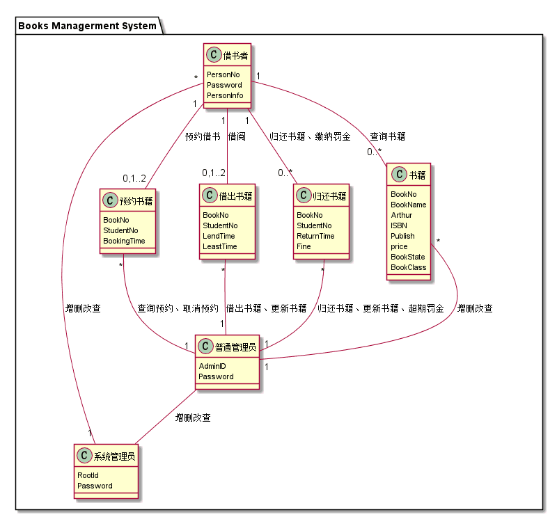
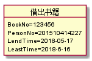
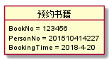

# 实验3：图书管理系统领域对象建模
|学号|班级|姓名|
|:-------:|:-------------: | :----------:|
|201510414227|软件(本)15-2|钟宇航|
## 1. 图书管理系统的类图
### 1.1 类图PlantUML源码如下：

``` class
@startuml
package "Books Managerment System" {
class 预约书籍 {
  BookNo
  StudentNo
  BookingTime
}
class 借出书籍 {
  BookNo
  StudentNo
  LendTime
  LeastTime
}
class 归还书籍 {
  BookNo
  StudentNo
  ReturnTime
  Fine

}
class 书籍 {
   BookNo
   BookName
   Arthur
   ISBN
   Publish
   price
   BookState
   BookClass
}


class 借书者 {
   PersonNo
   Password
   PersonInfo
}
class 普通管理员{
    AdminID
    Password
 }
class 系统管理员 {
   RootId
   Password

}

借书者"1" -- "0..*"书籍:查询书籍
借书者"1" -- "0,1..2"预约书籍:预约借书
借书者"1" -- "0,1..2"借出书籍:借阅
借书者"1" -- "0..*"归还书籍:归还书籍、缴纳罚金

书籍    "*"--"1" 普通管理员:增删改查
借出书籍"*"--"1" 普通管理员:借出书籍、更新书籍
归还书籍"*"--"1" 普通管理员:归还书籍、更新书籍、超期罚金
预约书籍"*"--"1" 普通管理员:查询预约、取消预约
借书者  "*"-"1"  系统管理员:增删改查
普通管理员 -- 系统管理员:增删改查

}
@enduml
```

### 1.2. 类图如下：



24


## 2. 图书管理系统的对象图

### 2.1 类借出书籍的对象图

#### 源码如下：

```class 

@startuml

object 借出书籍{
    BookNo=123456
    PersonNo=201510414227
    LendTime=2018-05-17
    LeastTime=2018-6-16
}
@enduml


``` 

#### 对象图如下：




### 2.2 类预约书籍的对象图

#### 源码如下：

``` class

@startuml

object 预约书籍{
   BookNo = 123456
   PersonNo = 201510414227
   BookingTime = 2018-4-20
}
@enduml


``` 

#### 对象图如下：

