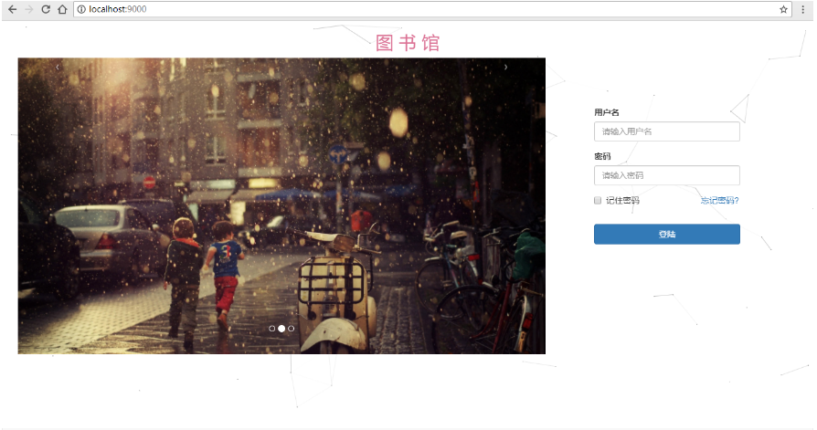
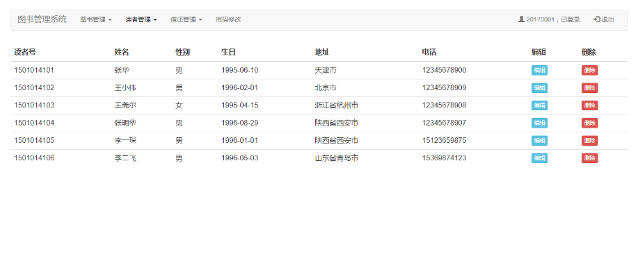
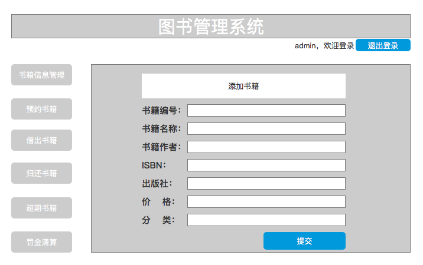
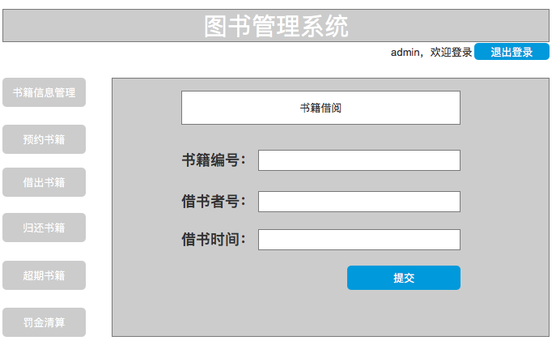

# 实验五：图书管理系统数据库设计与界面设计

|学号|班级|姓名|
|:-------:|:-------------:|:----------:|
|201510414227|软件(本)15-2|钟宇航|
### 1.数据库表设计

**1.1 books(图书表)**

|名称|类型|长度|是否允许NULL|键|注释|
|:---:|:---:|:----:|:---:|:---:|:----:|
|id|int|11|否| |图书添加时id（递增）|
|Book_id|int|20|否|主键|入馆图书序号|
|Book_name|varchar|255|否| |图书名称|
|Book_arthur|varchar|255|否| |图书作者|
|ISBN|varchar|255|否| 外键|图书标准书号|
|Book_pub|varchar|255|否| |图书出版社|
|Book_price|int|20|否| |图书单价|
|Book_status|varchar|20|否|  |图书状态|
|Book_dir|varchar|20|否| |图书类型|

**1.2 users(借书者表)**

|名称|类型|长度|是否允许NULL|键|注释|

|:---:|:---:|:----:|:---:|:---:|:----:|

|id|int|11|否| |用户注册时id（递增）|

|StudentNo|varchar|64|否|主键|借书者学号|

|username|varchar|64|否| |借书者名字|

|password|varchar|128|否| |借书者密码|

|class|varchar|64|否| |院系班级|

|take_bookId|varchar|255|是| |已借的书籍|

|return_bookId|varchar|255|是| |已归还的书籍|

|take_time|date|28|是| |借阅书籍时间|

|return_time|date|28|是| |归还书籍的时间|

|out_price|int|12|是| |超期缴纳的金额|

**1.3 admin(普通管理员表)**

|名称|类型|长度|是否允许NULL|键|注释|

|:---:|:---:|:----:|:---:|:---:|:----:|

|id|int|11|否| |普通管理员注册时id（递增）|

|AdminId|varchar|11|否|主键|普通管理员账户|

|Password|varchar|64|否| |普通管理员密码|

**1.4 root(系统管理员表)**

|名称|类型|长度|是否允许NULL|键|注释|

|:---:|:---:|:----:|:---:|:---:|:----:|

|id|int|11|否| |系统管理员注册时id（递增）|

|RootId|varchar|11|否|主键|系统管理员账户|

|Password|varchar|64|否| |系统管理员密码|

**1.5 Book_bk(预约书籍表)**

|名称|类型|长度|是否允许NULL|键|注释|

|:---:|:---:|:----:|:---:|:---:|:----:|

|id|int|11|否| 主键|预约id（递增）|

|Book_id|int|20|否| |入馆图书序号|

|StudentNo|varchar|64|否| |借书者学号|

|Date|date|20|否| |预约借书日期|

**1.6 Borrow_bk(借出记录表)**

|名称|类型|长度|是否允许NULL|键|注释|

|:---:|:---:|:----:|:---:|:---:|:----:|

|id|int|11|否| 主键|借出id（递增）|
|Book_id|int|20|否| |入馆图书序号|

|StudentNo|varchar|64|否| |借书者学号|

|Date|date|20|否| |借书日期|

|Date|date|20|否| |预计还书日期|

**1.7 Return_bk(归还记录表)**

|名称|类型|长度|是否允许NULL|键|注释|

|:---:|:---:|:----:|:---:|:---:|:----:|

|id|int|11|否| 主键|归还id（递增）|

|Book_id|int|20|否| |入馆图书序号|

|StudentNo|varchar|64|否| |借书者学号|

|Date|date|20|否| |还书日期|

|Over_day|int|10|否| |超期天数（默认为0）|

|Fine|int|10|是| |超期缴纳的罚金|

### 2.界面设计

**2.1 登录界面**

- 用例图参见：登录用例

- 类图参见：登录类

- API接口如下：

(1).登录API
- 请求地址：https://test.com/login

- 请求方法：POST
- 请求参数

|名称|说明|

|:---:|:---:|

|username|登录用户名|

|password|登录密码|

|role|登录角色|

- 返回实例：

{
    "code":"true/false";
}

- 返回参数说明：

|名称|说明|

|:---:|:---:|

|code|状态判断（true成功，false失败）|

**2.2 普通管理员界面**

- 用例图参见：登录用例

- 类图参见：登录类

- API接口如下：

(1).普通管理员操作API

- 请求地址：https://test.com/admin

- 请求方法：GET

**2.3 添加书籍界面**

- 用例图参见：普通管理员用例

- 类图参见：增加书籍类

- API接口如下：

(1).普通管理员操作API

- 请求地址：https://test.com/admin/addBook

-  请求方法：POST
- 请求参数：

|名称|说明|

|:---:|:---:|

|Book_id|入馆图书序号|

|Book_name|图书名称|

|Book_arthur|图书作者|

|ISBN|图书标准书号|

|Book_pub|图书出版社|

|Book_price|图书单价|

|Book_dir|图书类型（分类）|

- 返回实例：

{
    "code":"true/false";

}

- 返回参数说明：

|名称|说明|

|:---:|:---:|

|code|状态判断（true成功，false失败）|

**2.3 借出书籍界面**

为了保证安全借书还书，将以前借书者类图的借书还书集中在普通管理员的操作中，所以较之前类图会有点出入：
即用户界面仅给用户展示信息用，将操作（预约、借阅、归还）集中在管理员端来。

- 用例图参见：书籍用例

- 类图参见：借出书籍类

- API接口如下：

(1).普通管理员操作API

- 请求地址：https://test.com/admin/BoroowBook

请求方法：POST

- 请求参数：

|名称|说明|

|:---:|:---:|

|Book_id|入馆图书序号|

|StudentNo|借书者号|

|take_time|借书日期|

- 返回参数说明：

|名称|说明|

|:---:|:---:|

|code|状态判断（true成功，false失败）|

