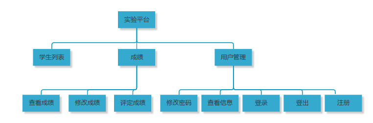
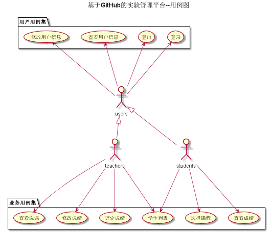
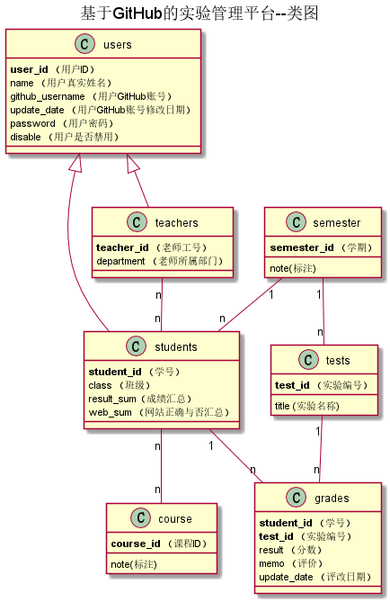

<!-- markdownlint-disable MD033-->
<!-- 禁止MD033类型的警告 https://www.npmjs.com/package/markdownlint -->

# 基于GitHub的实验管理平台的分析与设计

### 成都大学信息科学与工程学院

|学号|班级|姓名|
|:-------:|:-------------: | :----------:|
|201510414227|软件(本)15-2|钟宇航|

## 1. 概述
- 基于GitHub的实验管理平台的作用是在线管理实验成绩的Web应用系统。学生和老师的实验内容均存放在GitHUB
页面上。
- 学生的功能主要有：一是设置自己的GitHub用户名，二是查询自己的实验成绩。学生的GitHub用户名是公开的，但成绩不公开。
- 老师的功能主要有：一是批改每个学生的成绩，二是查看每个学生的成绩。
- 老师和学生都能通过本系统的链接方便地跳转到学生的每个GitHUB实验目录，以便批改实验或者查看实验情况。
- 实验成绩按数字分数计算，每项实验的满分为100分，最低为0分。
- 系统自动计算每个学生的所有实验的平均分。
    
## 2. 系统总体结构

## 3. 用例图设计 [源码](src/main/UserCase.puml)

## 4. 类图设计 [源码](src/main/class.puml)

## 5. 数据库设计
- ### [参见数据库设计](./DataDesign.md)

## 6. 用例及界面详细设计
- ### [“学生列表”用例](src/cases/StudentList.md),[界面](https://github.com/zhongyuhang/is_analysis/blob/master/test6/src/ui/student.png)
- ### [“评定成绩”用例](src/cases/Evaluationscore.md),[界面](https://github.com/zhongyuhang/is_analysis/blob/master/test6/src/ui/Evaluationscore.png)
- ### [“查看成绩”用例](src/cases/CheckGrade.md),[界面]( https://github.com/zhongyuhang/is_analysis/blob/master/test6/src/ui/checkScore.png)
- ### [“修改密码”用例](src/cases/Modify.md),[界面](https://github.com/zhongyuhang/is_analysis/blob/master/test6/src/ui/updatePwd.png)
- ### [“修改用户信息”用例](src/cases/ModifyUserInfo.md),[界面](https://github.com/zhongyuhang/is_analysis/blob/master/test6/src/ui/updateInfo.png)
- ### [“查看用户信息”用例](src/cases/FindUser.md),[界面](https://github.com/zhongyuhang/is_analysis/blob/master/test6/src/ui/userInfo.png)
- ### [“登出”用例](src/cases/logout.md),[界面](https://github.com/zhongyuhang/is_analysis/blob/master/test6/src/ui/logout.png)
- ### [“登录”用例](src/cases/login.md),[界面](https://github.com/zhongyuhang/is_analysis/blob/master/test6/src/ui/login.png)
- ### [“修改成绩”用例](src/cases/UpdateScore.md),[界面](https://github.com/zhongyuhang/is_analysis/blob/master/test6/src/ui/checkScore.png)
- ### [“选择课程”用例](src/cases/CheckCourse.md),[界面](https://github.com/zhongyuhang/is_analysis/blob/master/test6/src/ui/checkCourse.png)
