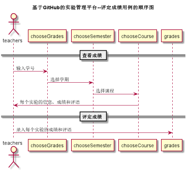

<!-- markdownlint-disable MD033-->
<!-- 禁止MD033类型的警告 https://www.npmjs.com/package/markdownlint -->

# “评定成绩”用例 [返回](../../README.md)
## 1. 用例规约

|用例名称|评定成绩|
|-------|:-------------|
|功能|老师评定一个学生的实验成绩|
|参与者|老师|
|前置条件|查看成绩：评定成绩之前，每个老师需要先登录，并显示出一个学生的所有实验成绩和评语信息|
|后置条件| 评定成绩提交之后，系统自动设置成绩更新日期为当前日期，根据各实验成绩自动计算平均成绩|
|主事件流| 1. 查看已有的成绩   2. 输入一个或者多个实验的成绩和评语    3. 提交    4. 系统存储实验成绩和评语  5. 系统自动计算平均成绩|
|备选事件流|1a. 成绩必须是0至100之间，可以为空，但不能超界  &nbsp;&nbsp; 1.提示用户重新输入成绩分数|

## 2. 业务流程（顺序图） [源码](../main/Evaluationscore.puml)
 

    
## 3. 界面设计
- 界面参照: https://github.com/zhongyuhang/is_analysis/blob/master/test6/src/ui/Evaluationscore.png

- API接口调用

    - 接口1：[getOneStudentResult](../mapper/getOneStudentResult.md)
        
        用于显示一个学生的所有实验成绩和评语
         
    - 接口2：[setOneStudentResults](../mapper/setOneStudentResults.md)
    
        用于获取一个学生的某次实验成绩和评语
    
## 4. 算法描述
    无
    
## 5. 参照表

- [STUDENTS](../DataDesign.md/#STUDENTS)
- [Teacher_Student](../DataDesign.md/#Teacher_Student)
- [Semester](../DataDesign.md/#Semester)
- [GRADES](../DataDesign.md/#GRADES)
- [TESTS](../DataDesign.md/#TESTS)
- [TEACHERS](../DataDesign.md/#TEACHERS)
