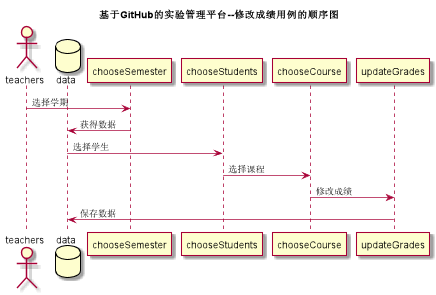

<!-- markdownlint-disable MD033-->
<!-- 禁止MD033类型的警告 https://www.npmjs.com/package/markdownlint -->

# “修改成绩”用例 [返回](../../README.md)
## 1. 用例规约

|用例名称||
|-------|:-------------|
|功能|老师对学生的成绩修改|
|参与者|老师|
|前置条件|老师需要先登录|
|后置条件| |
|主事件流|修改学生成绩|
|备选事件流| |

## 2. 业务流程（顺序图） [源码](../main/UpdateScore.puml)
 

## 3. 界面设计
- 界面参照:https://github.com/zhongyuhang/is_analysis/blob/master/test6/src/ui/checkScore.png
- API接口调用
    - 接口1：[getOneStudentResults](../mapper/getOneStudentResult.md) 

## 4. 算法描述
    无
    
## 5. 参照表
- [STUDENTS](../../DataDesign.md/#STUDENTS)
- [Teacher_Student](../../DataDesign.md/#Teacher_Student)
- [Semester](../../DataDesign.md/#Semester)
- [GRADES](../../DataDesign.md/#GRADES)
- [TESTS](../../DataDesign.md/#TESTS)
- [TEACHERS](../../DataDesign.md/#TEACHERS)
